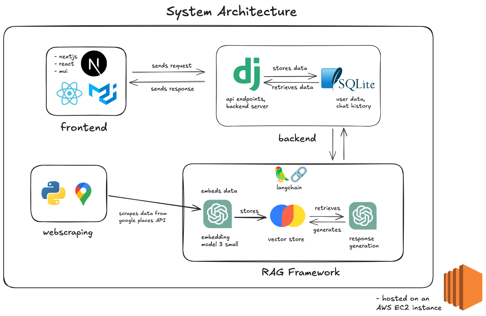

# Munch - Los Angeles LA

A chatbot designed to help users find food options in the Los Angeles area. This project leverages natural language processing (NLP) to understand user queries and integrates with various APIs to provide real-time information about restaurants, food types, and locations.

## Table of Contents

- [Architecture](#architecture)
- [Installation](#installation)
- [Usage](#usage)
- [Tech-Stack](#tech-stack)

## Architecture



## Installation

### Prerequisites

- [Conda](https://docs.conda.io/projects/conda/en/latest/user-guide/install/index.html) (for environment management)
- [Python](https://www.python.org/downloads/) (version 3.10)

### Setup

1. Clone the repository:

   ```bash
   git clone https://github.com/your-username/your-repo-name.git
   cd your-repo-name
   ```

2. Create a new conda environment:

   ```bash
   conda create --name your-env-name python=3.10
   conda activate your-env-name
   ```

3. Install dependencies:

   ```bash
   pip install -r requirements.txt
   ```

4. Set up API keys in a `.env` file in the base directory with the following content:

   ```bash
   OPENAI_API_KEY=your_openai_api_key
   PYTHONPATH=/path/to/your/project
   ```

5. Load the environment variables by running the following command in each new terminal session:

   ```bash
   source ./load_env.sh
   ```

6. Populate your ChromaDB database by running:

   ```bash
   python langchain_testing/src/generate_db.py
   ```

   This will store the restaurant data in your ChromaDB for querying.

## Usage

To start the backend and frontend (run each step in separate terminals):

1. Launch the backend server:

   ```bash
   python backend/manage.py runserver
   ```

2. Launch the frontend:

   ```bash
   cd frontend
   npm install  # Only needed the first time
   npm run dev
   ```

## Tech-Stack

### Backend:

- **LangChain**: LangChain is used to build applications that integrate language models into complex workflows. It’s particularly useful for creating data pipelines that involve natural language processing (NLP), such as generating text or analyzing documents.

- **OPENAI GPT-4o mini**: This variant of GPT-4 is used for generating human-like text based on the input it receives. It’s a lighter version designed to deliver efficient performance while maintaining a high degree of accuracy in text generation tasks.

- **ChromaDB**: ChromaDB is used for managing and querying large-scale vector embeddings. It’s essential for applications that require fast retrieval of data, particularly when working with embeddings generated by models like GPT or other language models.

- **OPENAI text-embedding-3-small**: This embedding model is employed to convert text into numerical vectors that capture the semantic meaning of the text. These embeddings are then stored in ChromaDB and used for tasks such as similarity search, classification, or clustering.

- **Django**: Django serves as the web framework for developing the backend of the application. It’s used to handle HTTP requests, manage database interactions, and serve the API endpoints required by the frontend.

- **SQLite3**: SQLite3 is the database used in this stack. It’s a lightweight, serverless database engine that integrates seamlessly with Django, making it ideal for small to medium-sized applications where simplicity and ease of use are priorities.

### Frontend:

- **Next.js**: Next.js is a React framework that enables server-side rendering and static site generation, providing a highly optimized and dynamic frontend. It’s used for building the user interface, handling routing, and ensuring fast page loads.

- **JavaScript**: JavaScript is the core programming language used for adding interactivity to the frontend. It powers dynamic content, handles events, and interacts with the backend via API calls.

- **Material-UI**: Material-UI is a popular React component library that implements Google’s Material Design. It’s used to build a responsive and aesthetically pleasing user interface with pre-designed components like buttons, forms, and cards.
